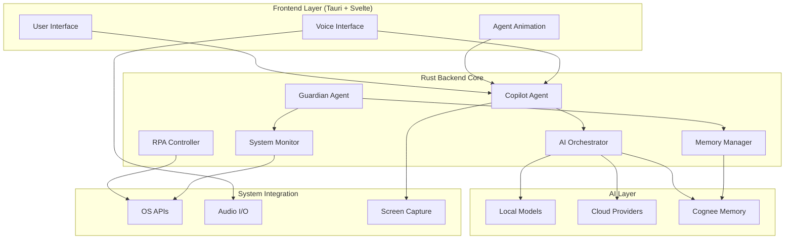
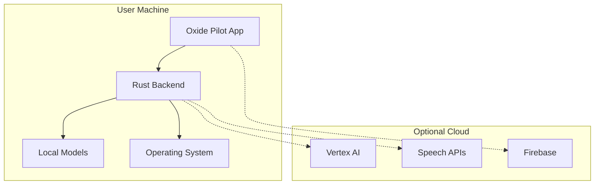
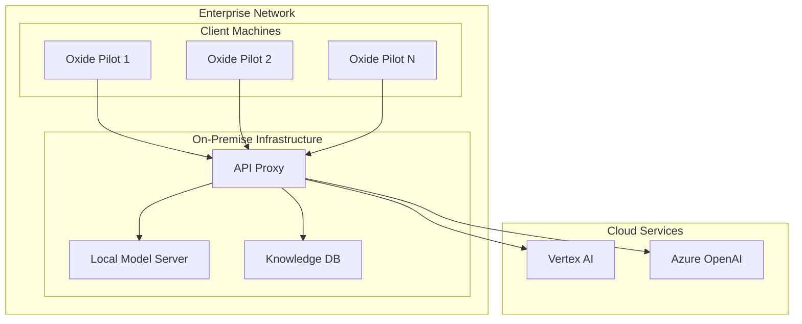

# Design Document

## Overview

Oxide Pilot es un sistema agéntico de próxima generación que combina monitoreo de sistema, seguridad EDR, y asistencia conversacional por IA. El diseño se basa en una arquitectura dual de agentes construida sobre Rust para máximo rendimiento y seguridad, con una interfaz moderna en Tauri y capacidades de IA tanto cloud como locales.

La arquitectura está diseñada para ser modular, escalable y segura, permitiendo desde uso completamente offline hasta integración cloud completa según las necesidades del usuario.

## Architecture

### High-Level Architecture



### Core Architecture Principles

1. **Separation of Concerns**: Guardian Agent (monitoring) y Copilot Agent (interaction) con responsabilidades claramente definidas
2. **Modular Design**: Cada componente es independiente y puede ser actualizado sin afectar otros
3. **Security First**: Todas las comunicaciones encriptadas, permisos granulares, y validación estricta
4. **Performance Optimized**: Rust para operaciones críticas, lazy loading, y resource pooling
5. **Provider Agnostic**: Abstracción de proveedores de IA para máxima flexibilidad

## Components and Interfaces

### 1. Guardian Agent (Rust Core)

**Responsabilidad**: Monitoreo continuo del sistema y seguridad EDR

```rust
pub struct GuardianAgent {
    system_monitor: SystemMonitor,
    threat_detector: ThreatDetector,
    performance_optimizer: PerformanceOptimizer,
    memory_manager: Arc<MemoryManager>,
    event_bus: EventBus,
}

impl GuardianAgent {
    pub async fn start_monitoring(&self) -> Result<(), GuardianError>;
    pub async fn detect_threats(&self) -> Vec<ThreatEvent>;
    pub async fn optimize_system(&self) -> OptimizationReport;
    pub async fn handle_security_event(&self, event: SecurityEvent);
}
```

**Key Features**:
- Monitoreo de procesos en tiempo real usando `sysinfo` y `windows-rs` (Básico implementado con `sysinfo`)
- Detección de amenazas con `yara-rust` y heurísticas personalizadas (Integración básica de YARA)
- Optimización automática de recursos del sistema (Estructura básica implementada)
- Registro de eventos en memoria contextual (Placeholder)

### 2. Copilot Agent (Rust Core)

**Responsabilidad**: Interfaz conversacional y control agéntico

```rust
pub struct CopilotAgent {
    ai_orchestrator: AIOrchestrator,
    voice_processor: VoiceProcessor,
    rpa_controller: RPAController,
    screen_analyzer: ScreenAnalyzer,
    memory_manager: Arc<MemoryManager>,
}

impl CopilotAgent {
    pub async fn activate(&self) -> Result<(), CopilotError>;
    pub async fn process_voice_input(&self, audio: AudioData) -> Response;
    pub async fn execute_action(&self, action: AgentAction) -> ActionResult;
    pub async fn analyze_screen(&self, region: Option<Rect>) -> ScreenAnalysis;
}
```

**Key Features**:
- Wake word detection con `picovoice` (Placeholder)
- Procesamiento de voz con múltiples proveedores (Placeholders)
- Control RPA usando `rdev` para mouse/keyboard (Básico implementado)
- Análisis visual con capturas de pantalla (Básico implementado)

### 3. AI Orchestrator (Multi-Provider Support)

**Responsabilidad**: Gestión unificada de múltiples proveedores de IA

```rust
pub trait AIProvider: Send + Sync {
    async fn generate_response(&self, prompt: &str, context: &Context) -> Result<String, AIError>;
    async fn analyze_image(&self, image: &[u8], prompt: &str) -> Result<String, AIError>;
    async fn function_call(&self, functions: &[Function], prompt: &str) -> Result<FunctionCall, AIError>;
}

pub struct AIOrchestrator {
    providers: HashMap<String, Box<dyn AIProvider>>,
    local_models: LocalModelManager,
    active_provider: String,
    fallback_chain: Vec<String>,
}

impl AIOrchestrator {
    pub async fn process_query(&self, query: &str, context: &Context) -> Result<Response, AIError>;
    pub async fn switch_provider(&mut self, provider: &str) -> Result<(), AIError>;
    pub fn add_provider(&mut self, name: String, provider: Box<dyn AIProvider>);
}
```

**Supported Providers**:
- **Google Vertex AI**: Gemini 1.5 Pro con multimodalidad (Integración avanzada con autenticación OAuth2, refresco de tokens, llamadas a `generateContent` y bucle de llamada a funciones. **Progreso: 80%**)
- **OpenAI**: GPT-4 y modelos especializados (Placeholder)
- **Anthropic**: Claude con análisis profundo (Placeholder)
- **Azure OpenAI**: Integración empresarial (Placeholder)
- **Local Models**: Ollama, LM Studio, GGML (Placeholder para Ollama)

### 4. Memory Manager (Cognee Integration)

**Responsabilidad**: Gestión de memoria contextual y aprendizaje

```rust
pub struct MemoryManager {
    cognee_client: CogneeClient,
    local_cache: LRUCache<String, MemoryEntry>,
    knowledge_graph: KnowledgeGraph,
    embedding_store: VectorStore,
}

impl MemoryManager {
    pub async fn store_interaction(&self, interaction: &Interaction) -> Result<(), MemoryError>;
    pub async fn retrieve_context(&self, query: &str) -> Result<Vec<ContextEntry>, MemoryError>;
    pub async fn update_knowledge_graph(&self, entities: &[Entity], relations: &[Relation]);
    pub async fn get_user_patterns(&self, user_id: &str) -> Result<UserPatterns, MemoryError>;
}
```

**Key Features**:
- Integración completa con Cognee para arquitectura cognitiva (Placeholder)
- Almacenamiento de interacciones, eventos del sistema, y patrones de uso (Estructuras definidas, almacenamiento básico en HashMap)
- RAG (Retrieval-Augmented Generation) para respuestas contextualizadas (Pendiente)
- Grafo de conocimiento para relaciones complejas (Pendiente)

### 5. RPA Controller (System Automation)

**Responsabilidad**: Control automatizado del sistema operativo

```rust
pub struct RPAController {
    mouse_controller: MouseController,
    keyboard_controller: KeyboardController,
    screen_capture: ScreenCapture,
    permission_manager: PermissionManager,
}

impl RPAController {
    pub async fn move_mouse(&self, x: i32, y: i32) -> Result<(), RPAError>;
    pub async fn click(&self, button: MouseButton, x: i32, y: i32) -> Result<(), RPAError>;
    pub async fn type_text(&self, text: &str) -> Result<(), RPAError>;
    pub async fn send_key_combination(&self, keys: &[Key]) -> Result<(), RPAError>;
    pub async fn capture_screen(&self, region: Option<Rect>) -> Result<Image, RPAError>;
    pub async fn find_element(&self, template: &Image) -> Result<Option<Point>, RPAError>;
}
```

**Key Features**:
- Control preciso de mouse y teclado usando `rdev` (Básico implementado)
- Captura de pantalla multiplataforma con `screenshots` (Básico implementado)
- Reconocimiento de elementos visuales para automatización inteligente (Pendiente)
- Sistema de permisos granular para acciones críticas (Placeholder)

### 6. Voice Processing System

**Responsabilidad**: Procesamiento completo de audio (entrada y salida)

```rust
pub struct VoiceProcessor {
    wake_word_detector: WakeWordDetector,
    stt_providers: HashMap<String, Box<dyn STTProvider>>,
    tts_providers: HashMap<String, Box<dyn TTSProvider>>,
    audio_manager: AudioManager,
}

impl VoiceProcessor {
    pub async fn start_wake_word_detection(&self) -> Result<(), VoiceError>;
    pub async fn transcribe_audio(&self, audio: AudioData) -> Result<String, VoiceError>;
    pub async fn synthesize_speech(&self, text: &str) -> Result<AudioData, VoiceError>;
    pub async fn detect_voice_activity(&self, audio: AudioData) -> bool;
}
```

**Supported Services**:
- **Cloud**: Google Speech-to-Text/TTS, Azure Cognitive Services, AWS Polly (Placeholders)
- **Local**: Whisper local, Piper TTS, Festival (Placeholders)
- **Wake Word**: Picovoice Porcupine para detección local (Placeholder)

## Data Models

### Core Data Structures

```rust
// Evento del sistema
#[derive(Debug, Serialize, Deserialize)]
pub struct SystemEvent {
    pub id: Uuid,
    pub timestamp: DateTime<Utc>,
    pub event_type: EventType,
    pub source: EventSource,
    pub data: serde_json::Value,
    pub severity: Severity,
}

// Interacción con el usuario
#[derive(Debug, Serialize, Deserialize)]
pub struct Interaction {
    pub id: Uuid,
    pub user_id: String,
    pub timestamp: DateTime<Utc>,
    pub input_type: InputType, // Voice, Text, Visual
    pub input_data: String,
    pub response: String,
    pub actions_taken: Vec<AgentAction>,
    pub context_used: Vec<String>,
}

// Acción del agente
#[derive(Debug, Serialize, Deserialize)]
pub struct AgentAction {
    pub action_type: ActionType,
    pub parameters: HashMap<String, serde_json::Value>,
    pub timestamp: DateTime<Utc>,
    pub result: ActionResult,
    pub requires_permission: bool,
}

// Contexto de memoria
#[derive(Debug, Serialize, Deserialize)]
pub struct Context {
    pub system_state: SystemState,
    pub user_history: Vec<Interaction>,
    pub relevant_events: Vec<SystemEvent>,
    pub knowledge_entries: Vec<KnowledgeEntry>,
}
```

### Configuration Models

```rust
#[derive(Debug, Serialize, Deserialize)]
pub struct OxidePilotConfig {
    pub guardian_agent: GuardianConfig,
    pub copilot_agent: CopilotConfig,
    pub ai_providers: AIProvidersConfig,
    pub security: SecurityConfig,
    pub performance: PerformanceConfig,
}

#[derive(Debug, Serialize, Deserialize)]
pub struct AIProvidersConfig {
    pub active_provider: String,
    pub fallback_providers: Vec<String>,
    pub local_models: LocalModelsConfig,
    pub cloud_providers: HashMap<String, ProviderConfig>,
}
```

## Error Handling

### Comprehensive Error Management

```rust
#[derive(Debug, thiserror::Error)]
pub enum OxidePilotError {
    #[error("Guardian Agent error: {0}")]
    Guardian(#[from] GuardianError),

    #[error("Copilot Agent error: {0}")]
    Copilot(#[from] CopilotError),

    #[error("AI Provider error: {0}")]
    AIProvider(#[from] AIError),

    #[error("Memory system error: {0}")]
    Memory(#[from] MemoryError),

    #[error("RPA operation error: {0}")]
    RPA(#[from] RPAError),

    #[error("Voice processing error: {0}")]
    Voice(#[from] VoiceError),

    #[error("System integration error: {0}")]
    System(#[from] SystemError),
}
```

### Error Recovery Strategies

1. **Graceful Degradation**: Si falla un proveedor cloud, cambiar automáticamente a local
2. **Retry Logic**: Reintentos exponenciales para operaciones de red
3. **Fallback Chains**: Múltiples proveedores configurados en orden de preferencia
4. **User Notification**: Alertas claras cuando funcionalidades no están disponibles
5. **Logging**: Registro detallado para debugging y análisis post-mortem

## Testing Strategy

### Unit Testing

```rust
#[cfg(test)]
mod tests {
    use super::*;

    #[tokio::test]
    async fn test_guardian_agent_threat_detection() {
        let guardian = GuardianAgent::new_test();
        let threats = guardian.detect_threats().await;
        assert!(threats.is_empty()); // En entorno de test limpio
    }

    #[tokio::test]
    async fn test_ai_orchestrator_provider_switching() {
        let mut orchestrator = AIOrchestrator::new();
        orchestrator.add_test_providers();

        let result = orchestrator.switch_provider("local").await;
        assert!(result.is_ok());
    }
}
```

### Integration Testing

1. **End-to-End Voice Flow**: Wake word → Transcription → LLM → TTS → Audio output
2. **RPA Automation**: Captura de pantalla → Análisis visual → Acción automatizada
3. **Memory Persistence**: Almacenamiento → Recuperación → Contextualización
4. **Multi-Provider Fallback**: Fallo de proveedor → Cambio automático → Continuidad

### Performance Testing

1. **Load Testing**: Múltiples interacciones simultáneas
2. **Memory Usage**: Monitoreo de uso de RAM durante operación prolongada
3. **Latency Testing**: Tiempo de respuesta para diferentes tipos de consultas
4. **Resource Optimization**: Impacto en rendimiento del sistema host

### Security Testing

1. **Permission Validation**: Verificación de permisos antes de acciones críticas
2. **Data Encryption**: Validación de encriptación end-to-end
3. **API Key Management**: Almacenamiento seguro usando OS keychain/credential manager
4. **Memory Protection**: Limpieza segura de datos sensibles en memoria

## Deployment Architecture

### Local Deployment



### Enterprise Deployment



## Security Considerations

### Data Protection

1. **Encryption at Rest**: Todas las configuraciones y datos sensibles encriptados localmente
2. **Encryption in Transit**: TLS 1.3 para todas las comunicaciones cloud
3. **API Key Management**: Almacenamiento seguro usando OS keychain/credential manager
4. **Memory Protection**: Limpieza segura de datos sensibles en memoria

### Access Control

1. **Permission System**: Granular permissions para cada tipo de acción RPA
2. **User Authentication**: Integración con sistemas de autenticación empresariales
3. **Audit Logging**: Registro completo de todas las acciones del agente
4. **Sandboxing**: Aislamiento de operaciones críticas del sistema

### Privacy Protection

1. **Local Processing**: Opción de procesamiento completamente local
2. **Data Minimization**: Solo enviar datos necesarios a servicios cloud
3. **User Consent**: Confirmación explícita para acciones sensibles
4. **Data Retention**: Políticas configurables de retención de datos

Este diseño proporciona una base sólida para construir Oxide Pilot como un sistema agéntico de próxima generación, balanceando potencia, flexibilidad, seguridad y rendimiento.
