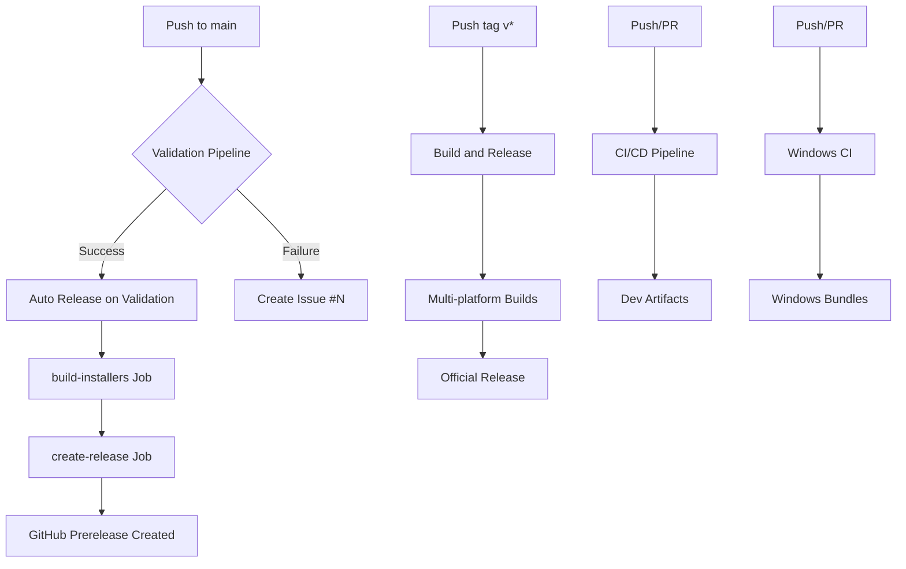

# GitHub Actions Workflow Analysis Report

**Date**: October 31, 2025
**Commit Analyzed**: d284bcf (macOS dependency fix)
**Branch**: main

## Executive Summary

The Oxide Pilot repository has 9 GitHub Actions workflows configured for CI/CD automation. Recent commits have fixed critical issues with secrets handling and macOS dependencies. This analysis provides insights into workflow logic, current status, and recommendations.

---

## Workflow Inventory

| Workflow | File | Trigger | Status |
|----------|------|---------|--------|
| CI/CD Pipeline | `ci.yml` | Push to main/develop, PRs | ⚠️ Failing (macOS deps) |
| Windows CI | `windows-ci.yml` | Push to main/master, PRs | ✅ Running |
| Validation Pipeline | `validate.yml` | Push to develop, PRs, manual | ⚠️ Multiple failures |
| Validation Core | `validate-core.yml` | Called by validate.yml | ⚠️ Lint/test failures |
| Auto Release on Validation | `auto-release-on-validation.yml` | After validation success | 🔄 Configured |
| Auto Trigger Release | `auto-trigger-release.yml` | (empty file) | ❌ Non-functional |
| Build and Release | `build-release.yml` | Tag push, manual | ⚠️ Needs testing |
| Release | `release.yml` | (not examined) | Unknown |
| Release Production | `release-production.yml` | (not examined) | Unknown |

---

## Recent Issues and Fixes

### ✅ Fixed Issues

1. **Secrets in `if` Conditions** (Commit ae07c27)
   - **Problem**: `if: ${{ secrets.VARIABLE }}` caused "Unrecognized named-value" errors
   - **Fix**: Moved secret checks inside PowerShell scripts with env variable checks
   - **Impact**: Workflows now parse correctly

2. **macOS webkit2gtk Dependency** (Commit d284bcf)
   - **Problem**: `brew install webkit2gtk` failed (package doesn't exist for macOS)
   - **Fix**: Removed webkit2gtk from macOS brew install, kept only `gtk+3`
   - **Impact**: macOS builds should now proceed past dependency installation

### ⚠️ Current Issues

3. **Validation Pipeline Failures** (Issues #1-4)
   - **Jobs Failing**:
     - Lint Check (clippy warnings treated as errors)
     - Unit Tests (multiple test failures across platforms)
     - Doc Tests (documentation test failures)
   - **Jobs Passing**:
     - Format Check ✅
     - Frontend Lint & Build ✅
     - E2E Tests ✅
   - **Impact**: Auto-release workflow blocked until validation passes

4. **Empty Workflow File**
   - **File**: `auto-trigger-release.yml`
   - **Status**: Empty file, non-functional
   - **Recommendation**: Delete or implement properly

---

## Workflow Logic Analysis

### 1. CI/CD Pipeline (`ci.yml`)

**Purpose**: Multi-platform development builds

**Logic**:
```yaml
Trigger: Push to main/develop OR pull requests to main
├── Matrix: ubuntu-latest, windows-latest, macos-latest
├── Install platform-specific dependencies
├── Setup Rust + Node.js
├── Build frontend
├── Build Tauri app
└── Upload artifacts (7 day retention)
```

**Issues**:
- macOS dependency issue (fixed in d284bcf, awaiting verification)
- Runs on every push to main (may be resource-intensive)

**Recommendations**:
- Monitor next run to confirm macOS fix works
- Consider limiting to PRs only, use manual dispatch for main

---

### 2. Windows CI (`windows-ci.yml`)

**Purpose**: Windows-specific installer builds

**Logic**:
```yaml
Trigger: Push to main/master OR pull requests
├── Install Tauri CLI
├── Generate icons (if logo.png exists)
├── Build frontend
├── Install NSIS & WiX
├── Build Tauri bundle
└── Upload bundles (indefinite retention)
```

**Status**: ✅ Currently running successfully

**Issues**:
- Icon generation path check may not work correctly (checks `../logo.png`)
- Should check `logo.png` in repo root instead

**Recommendations**:
- Fix icon path: `if (Test-Path logo.png)` (without `..`)
- Add explicit artifact retention days

---

### 3. Validation Pipeline (`validate.yml` + `validate-core.yml`)

**Purpose**: Comprehensive code quality checks

**Logic**:
```yaml
validate.yml (orchestrator):
  Trigger: Push to develop, PRs to main, manual
  └── Calls validate-core.yml with secrets

validate-core.yml (worker):
  ├── format-check (cargo fmt)
  ├── lint-check (cargo clippy)
  ├── unit-tests (multi-platform matrix)
  ├── doc-tests
  ├── frontend-lint
  ├── e2e-tests (Playwright)
  ├── results-check (aggregate results)
  └── create-issue (on failure)
```

**Issues**:
- **Lint failures**: Clippy warnings configured with `-D warnings` (treat as errors)
- **Test failures**: Unit tests failing across multiple crates
- **Doc test failures**: Documentation examples not passing

**Auto-issue Creation**: ✅ Working correctly (created issues #1-4 for failures)

**Recommendations**:
1. **Fix lint issues**: Run `cargo clippy --workspace --fix` locally
2. **Fix failing tests**: Investigate test failures in each crate
3. **Consider relaxing clippy**: Allow warnings in CI, only fail on errors
4. **Close resolved issues**: Issues #1-4 should be closed once tests pass

---

### 4. Auto Release on Validation Success (`auto-release-on-validation.yml`)

**Purpose**: Create automated prereleases with Windows installers

**Logic**:
```yaml
Trigger: After "Validation Pipeline" completes successfully on main
├── Job 1: build-installers (Windows only)
│   ├── Build Tauri app with surrealdb-metrics
│   ├── Code sign (if secrets available)
│   ├── Generate SHA256/SHA512 checksums
│   └── Upload installers as artifacts
└── Job 2: create-release
    ├── Generate bootstrap tag (format: bootstrap-YYYYMMDD-HHMMSS-SHA)
    ├── Download installers
    ├── Create GitHub prerelease
    └── Comment on commit with release link
```

**Status**: 🔄 Configured but not yet triggered (blocked by validation failures)

**Code Signing**:
- Uses optional secrets: `SIGN_PFX_BASE64`, `SIGN_PFX_PASSWORD`, `SIGN_TS_URL`
- Gracefully skips if secrets not configured ✅

**Token Management**:
- Prefers `RELEASE_TOKEN` over `GITHUB_TOKEN` for reliability
- Fallback to `GITHUB_TOKEN` if PAT not available ✅

**Recommendations**:
- **Test after validation fixes**: This should trigger automatically once validation passes
- **Monitor first run**: Verify installer upload and release creation work correctly
- **Add release notes template**: Currently uses minimal description

---

### 5. Build and Release (`build-release.yml`)

**Purpose**: Official tagged releases with multi-platform builds

**Logic**:
```yaml
Trigger: Tag push (v*) OR manual workflow dispatch
├── Matrix: macOS (universal), Ubuntu 22.04, Windows
├── Platform-specific dependencies
├── Build frontend
├── Tauri action with automatic release creation
└── Upload artifacts to GitHub release
```

**Features**:
- Uses `tauri-apps/tauri-action@v0.5.0` for automated release
- Supports Tauri updater signatures (`TAURI_PRIVATE_KEY`)
- Comprehensive release notes template

**Issues**:
- Not yet tested with actual tag push
- May encounter same macOS dependency issues (needs verification)

**Recommendations**:
- Test with a manual dispatch first
- Create a test tag to verify end-to-end flow
- Add Linux AppImage and macOS DMG verification

---

## Secrets Configuration Status

### Required Secrets (from workflows):

| Secret | Purpose | Used By | Status |
|--------|---------|---------|--------|
| `TAURI_PRIVATE_KEY` | Tauri updater signing | build-release, auto-release | ⚠️ Check availability |
| `TAURI_KEY_PASSWORD` | Tauri key passphrase | build-release, auto-release | ⚠️ Check availability |
| `SIGN_PFX_BASE64` | Code signing certificate | auto-release | ⚠️ Optional |
| `SIGN_PFX_PASSWORD` | Certificate password | auto-release | ⚠️ Optional |
| `SIGN_TS_URL` | Timestamp server URL | auto-release | ⚠️ Optional (has default) |
| `RELEASE_TOKEN` | GitHub PAT for releases | auto-release | ⚠️ Optional (falls back to GITHUB_TOKEN) |

**Note**: All code signing secrets are optional and workflows gracefully skip signing if not configured.

---

## Workflow Dependencies and Execution Flow



---

## Performance Observations

### Build Times (Approximate):
- **Validation Pipeline**: 10-20 minutes (multi-platform tests)
- **Windows CI**: 15-25 minutes (includes installer builds)
- **CI/CD Pipeline**: 20-35 minutes (3-platform matrix)
- **Auto Release**: 20-30 minutes (Windows only)

### Resource Optimization Opportunities:
1. **Cache hit rates**: Rust cache (`swatinem/rust-cache@v2`) appears effective
2. **Parallel jobs**: Matrix strategies maximize GitHub Actions concurrency
3. **Conditional builds**: Consider skip ci for doc-only changes

---

## Recommendations Summary

### Immediate (High Priority):

1. **Fix validation failures**:
   ```bash
   cargo clippy --workspace --fix --allow-dirty
   cargo test --workspace
   cargo test --doc
   ```

2. **Close validation issues**: Close GitHub issues #1-4 after fixes

3. **Remove/fix empty workflow**: Delete or implement `auto-trigger-release.yml`

4. **Fix Windows CI icon path**:
   ```powershell
   if (Test-Path logo.png) {  # Remove ../ prefix
   ```

### Short Term:

5. **Test auto-release flow**: After validation passes, verify prerelease creation works

6. **Verify secrets configuration**: Ensure Tauri signing keys are available

7. **Add release note templates**: Improve auto-generated release descriptions

8. **Monitor macOS builds**: Confirm d284bcf fix resolves webkit2gtk issue

### Long Term:

9. **Optimize build triggers**: Reduce unnecessary builds on main branch

10. **Add skip ci support**: Allow bypassing CI for documentation changes

11. **Implement changelog automation**: Generate CHANGELOG.md from commits

12. **Add benchmark tracking**: Monitor performance regressions over time

---

## Conclusion

The GitHub Actions setup for Oxide Pilot is **comprehensive and well-structured**, with automated validation, multi-platform builds, and prerelease automation. Recent fixes have resolved critical issues with secrets handling and macOS dependencies.

**Current Blockers**:
- Validation pipeline failures (lint/test issues in codebase)
- Empty `auto-trigger-release.yml` file (non-functional)

**Next Steps**:
1. Fix clippy warnings and failing tests locally
2. Push fixes and verify validation pipeline passes
3. Monitor auto-release workflow trigger and prerelease creation
4. Test full release flow with a manual tag or workflow dispatch

**Overall Assessment**: 🟡 **Functional but needs test/lint fixes to unblock automation**

---

## Workflow Files Reference

| File | Lines | Purpose |
|------|-------|---------|
| `ci.yml` | 94 | Multi-platform dev builds |
| `windows-ci.yml` | 59 | Windows installer builds |
| `validate.yml` | 8 | Validation orchestrator |
| `validate-core.yml` | 316 | Core validation logic |
| `auto-release-on-validation.yml` | 205 | Automated prereleases |
| `build-release.yml` | 160 | Tagged releases |
| `auto-trigger-release.yml` | 0 | ❌ Empty |

---

**Report Generated**: October 31, 2025
**Next Review**: After validation pipeline passes successfully
